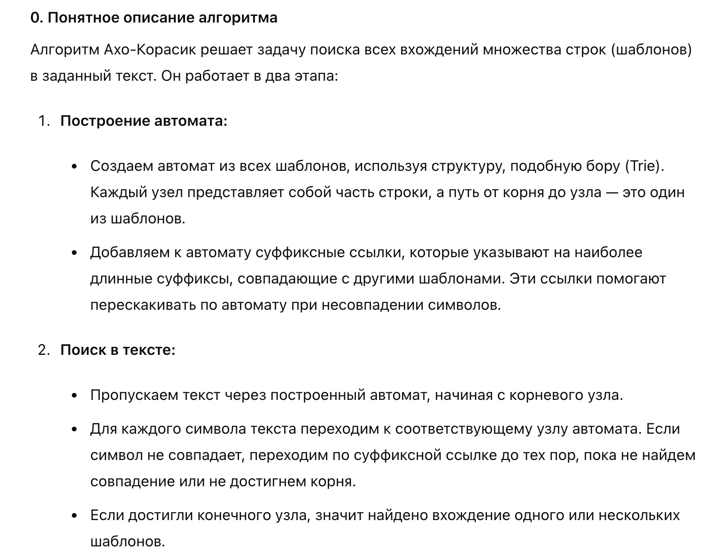
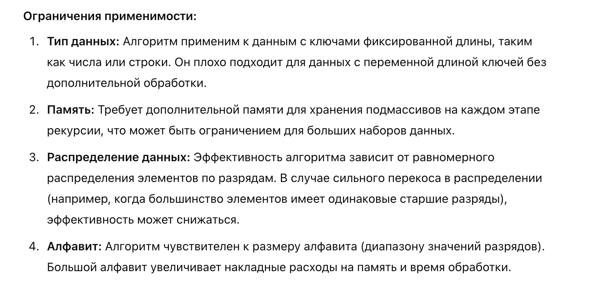

# АиСД-2 2024 Экзамен

## Раздел 1: Графовые алгоритмы

## 1.1. Опишите реализацию алгоритма Дейкстры. Проиллюстрируйте алгоритм на заданном графе, построив кратчайший путь из $A$ в $E$.


### Алгоритм Дейкстры
Алгоритм Дейкстры используется для нахождения кратчайших путей из одной вершины графа до всех остальных его вершин. Основная идея алгоритма заключается в том, чтобы постепенно расширять множество рассмотренных вершин, выбирая на каждом шаге вершину с наименьшим расстоянием от начальной и обновляя расстояния до всех её соседей.

**0.** Установим для первой вершины характеристику $d = 0$, а для остальных - $\infty$:

Для этого мы создадим массив $d$, где для каждой вершины $v$ будем хранить длину кратчайшего пути $d_v$ из $A$ в $v$. Сейчас он выглядит так:

| $d_A$ | $d_B$ | $d_C$ | $d_D$ | $d_E$ |
|-------|-------|-------|-------|-------|
| $0$ | $\infty$ | $\infty$ | $\infty$ | $\infty$ |

Также создадим массив $a$ из $5$ нулей, для того чтобы помечать уже рассмотренные вешины:
| $a_A$ | $a_B$ | $a_C$ | $a_D$ | $a_E$ |
|-------|-------|-------|-------|-------|
| $0$ | $0$ | $0$ | $0$ | $0$ |

**1.** Выберем из нерассмотренных вершин ту, у которой характеристика $d$ наименьшая (в данном случае это начальная вершина $A$), и рассмотрим выходящие из нее пути:

**2.** Для каждой вершины $v$, в которую можно прийти из текущей вершины $p$, установим $d_v = \min(d_v, d_p + weight(v, p))$.
Таким образом, на этом шаге имеем:

Наш массив $d$ теперь имеет следующий вид:
| $d_A$ | $d_B$ | $d_C$ | $d_D$ | $d_E$ |
|-------|-------|-------|-------|-------|
| $0$ | $3$ | $6$ | $1$ | $\infty$ |

В массиве $a$ мы отметим вершину $A$ как рассмотренную:
| $a_A$ | $a_B$ | $a_C$ | $a_D$ | $a_E$ |
|-------|-------|-------|-------|-------|
| $1$ | $0$ | $0$ | $0$ | $0$ |

**3.** Будем повторять шаги 1-2 до тех пор, пока все вершины не будут рассмотренны.

Продемонстрируем этот процесс:

После рассмотрения вершины $A$ наименьшую характеристику $d$ имеет вершина $D$, рассмотрим ее:

Обновим соответствующие характеристики для вершин:

Массив $d$ теперь имеет следующий вид:
| $d_A$ | $d_B$ | $d_C$ | $d_D$ | $d_E$ |
|-------|-------|-------|-------|-------|
| $0$ | $3$ | $5$ | $1$ | $13$ |

В массиве $a$ мы отметим вершину $D$ как рассмотренную:
| $a_A$ | $a_B$ | $a_C$ | $a_D$ | $a_E$ |
|-------|-------|-------|-------|-------|
| $1$ | $0$ | $0$ | $1$ | $0$ |

Теперь наименьшую характеристику $d$ среди нерассмотренных вершин имеет вершина $B$:

Обновим характеристики:


Массив $d$ теперь имеет следующий вид:
| $d_A$ | $d_B$ | $d_C$ | $d_D$ | $d_E$ |
|-------|-------|-------|-------|-------|
| $0$ | $3$ | $5$ | $1$ | $12$ |

В массиве $a$ мы отметим вершину $B$ как рассмотренную:
| $a_A$ | $a_B$ | $a_C$ | $a_D$ | $a_E$ |
|-------|-------|-------|-------|-------|
| $1$ | $1$ | $0$ | $1$ | $0$ |

Остались лишь вершины $C$ и $E$. Так как $d_C < d_E$, необходимо рассмотреть и вершину $C$:
 
Наконец, последний раз обновим характеристики:

Массив $d$ теперь имеет следующий вид:
| $d_A$ | $d_B$ | $d_C$ | $d_D$ | $d_E$ |
|-------|-------|-------|-------|-------|
| $0$ | $3$ | $5$ | $1$ | $9$ |

В массиве $a$ мы отметим вершину $B$ как рассмотренную:
| $a_A$ | $a_B$ | $a_C$ | $a_D$ | $a_E$ |
|-------|-------|-------|-------|-------|
| $1$ | $1$ | $1$ | $1$ | $0$ |

Саму по себе вершину $E$ рассматривать нет смысла. Работа алгоритма завершена.

Для восстановления самого пути можно было создать дополнительный массив $t$, который в ячейке $t_v$ будет хранить родителя вершины $v$ - вершина, из которой прошла последняя релаксация по ребру $(t_v, v)$.

### Ассимптотическая сложность алгоритма Дейкстры
| Структура данных         | Время нахождения $\argmin$ | Время релаксации | Общее время работы | Общее время работы (плотный граф) |
|--------------------------|---------------------------|-------------------|--------------------|-----------------------------------|
| Массив                   | $O(n)$                    | $O(1)$            | $O(n^2 + m)$       | $O(n^2)$                          |
| Двоичная куча            | $O(\log n)$               | $O(\log n)$       | $O((n + m) \log n)$| $O(n^2 \log n)$                   |
| Фибоначчиева куча        | $O(\log n)$               | $O(1)$            | $O(n \log n + m)$  | $O(n^2)$                          |

### Ограничения применимости алгоритма Дейкстры
Алгоритм Дейкстры работает только для графов с неотрицательными весами ребер.

## 1.2. Опишите реализацию алгоритма Беллмана-Форда.

### Алгоритм Беллмана-Форда
**0.** Аналогично алгоритму Дейкстры, инициализируем массив $d$ кратчайших расстояний из начальной вершины до всех остальных.

**1.** Повторим $n - 1$ раз следующую операцию:\
**1.1.** Для каждого ребра $(u, v)$ установим $d_v = \min(d_v, d_u + weight(u, v))$.

**2.** Для каждого ребра $(u, v)$ проверим, что $d_u + weight(u, v) \geq d_v$. Иначе в графе есть отрицательный цикл (а значит задача не имеет смысла - кратчайший путь $\to -\infty$).

### Ассимптотическая сложность алгоритма Беллмана-Форда
$O(nm)$ в любом случае. Мы делаем $n - 1$ итераций по $m$ релаксаций плюс $O(m)$ операций на проверку отрицательных циклов.

### Ограничения алгоритма Беллмана-Форда
Менее эффективен по сравнению с алгоритмом Дейкстры, особенно в плотных графах.

## 2.1. Опишите реализацию алгоритма Джонсона.

### Алгоритм Джонсона
**1.** Добавим новую вершину $s$ к графу и соединим её с каждой другой вершиной 
$v$ в графе с помощью ребра с нулевым весом.\
**2.** Используем алгоритм Беллмана-Форда, начиная с новой вершины $s$, чтобы найти минимальные пути от $s$ до всех других вершин. Если алгоритм находит отрицательный цикл, то завершим выполнение, так как задача не имеет решения.\
**3.** Для каждого ребра $(u, v)$ переназначим вес следующим образом:
$$w'(u, w) = w(u, v) + h(u) - h(v)$$
где $h(v)$ - минимальное расстояние от вершины $s$ до вершины $v$, найденное в шаге 2.\
**4.** Применим алгоритм Дейкстры для нахождения для нахождения кратчайших путей от каждой вершины $u$ к каждой другой вершине $v$ в графе с переназначенными весами $w'$.
**5.** Пересчитаем найденные кратчайшие пути обратно к исходным весам ребер:
$$d(u, v) = d'(u, v) - h(u) + h(v)$$
где $d'(u, v)$ это кратчайшее расстояние между вершинами $u$ и $v$ в графе с переназначенными весами.

### Ассимптотическая сложность алгоритма Джонсона
**1. Добавление новой вершины**:
   Добавление одной вершины и $n$ рёбер занимает $O(n)$ времени.

**2. Алгоритм Беллмана-Форда**:
   Алгоритм Беллмана-Форда выполняется за $O(nm)$. Он выполняет $n$ итераций, каждая из которых обрабатывает все $m$ рёбра.

**3. Ребалансировка весов**:
   Переназначение весов всех $m$ рёбер требует $O(m)$ времени.

**4. Алгоритм Дейкстры**:
   Алгоритм Дейкстры запускается $n$ раз (один раз для каждой вершины). При использовании приоритетной очереди на основе двоичной кучи, время работы одного запуска составляет $O((n + m) \log n)$. Следовательно, общий вклад алгоритма Дейкстры составляет $O(n(n + m) \log n)$.

Таким образом, общая асимптотическая сложность алгоритма Джонсона будет:
$$ O(nm) + O(m) + O(n(n + m) \log n) \sim  O(nm + n(n + m) \log n) $$

### Ограничения на применимость алгоритма Джонсона

1. **Отрицательные циклы**:
   Алгоритм Джонсона не применим для графов с отрицательными циклами. Если алгоритм Беллмана-Форда обнаруживает такой цикл, алгоритм прекращает выполнение.

2. **Время и память на больших графах**:
   Алгоритм требует значительных вычислительных ресурсов на больших графах. Для графов с большим числом вершин и рёбер (например, $n \approx 10^5$ и $m \approx 10^6$) время выполнения может быть значительным.

3. **Плотные графы**:
   В случае плотных графов, где $m \approx n^2$, асимптотическая сложность становится $O(n^3 \log n)$. Это может быть вычислительно дорого для очень больших графов.

## 2.2. Опишите реализацию алгоритма Флойда–Уоршелла

### Алгоритм Флойда–Уоршелла
1. **Инициализация**:
   Создаём матрицу расстояний $D$, где $D[i][j]$ представляет кратчайшее расстояние от вершины $i$ до вершины $j$. Изначально $D[i][j]$ инициализируется весом ребра между вершинами $i$ и $j$. Если ребра нет, то устанавливается значение $\infty$ (бесконечность). Также $D[i][i]$ устанавливается в 0 для всех вершин $i$.

2. **Основной цикл**:
   Алгоритм проходит через каждую возможную промежуточную вершину $k$ и обновляет матрицу расстояний $D$ следующим образом:
   $$
   D[i][j] = \min(D[i][j], D[i][k] + D[k][j])
   $$
   Это означает, что алгоритм проверяет, является ли путь из вершины $i$ в вершину $j$ короче, если пройти через вершину $k$, и обновляет $D[i][j]$, если более короткий путь найден.

3. **Результат**:
   После выполнения всех итераций матрица $D$ будет содержать кратчайшие расстояния между всеми парами вершин.

### Асимптотическая сложность
Алгоритм Флойда–Уоршелла имеет временную сложность $O(n^3)$, где $n$ — количество вершин в графе. Это обусловлено тремя вложенными циклами по всем вершинам графа.

### Ограничения
**Отрицательные циклы:** Если граф содержит отрицательные циклы, алгоритм не сможет корректно найти кратчайшие пути, так как он будет постоянно уменьшать значения расстояний в цикле. В таких случаях необходимо предварительно проверять наличие отрицательных циклов (например, с помощью алгоритма Беллмана-Форда).

**Память:** Алгоритм использует $O(n^2)$ памяти для хранения матрицы расстояний, что может быть проблемой для очень больших графов.

## 3. Алгоритмы поиска максимального потока в сети
### Алгоритм Форда–Фалкерсона
Основная идея заключается в нахождении путей увеличения потока и постепенном увеличении общего потока, пока не исчерпаны все возможности увеличения.

### Шаги алгоритма:
**Инициализация:** Установить начальный поток равным нулю.\
**Поиск пути увеличения:** Использовать поиск в глубину или поиск в ширину для нахождения пути из истока в сток, вдоль которого есть возможность увеличить поток.\
**Обновление потоков:** Увеличить поток вдоль найденного пути на минимальное значение пропускной способности на этом пути.\
**Повторение:** Повторять шаги 2 и 3, пока существует путь увеличения.
Алгоритм заканчивается, когда не удается найти путь увеличения.

### Ассимптотическая сложность
В худшем случае, количество итераций алгоритма пропорционально максимальному потоку, который можно найти в сети. Если в каждой итерации увеличивается поток хотя бы на единицу, то общее количество итераций будет $O(F)$, где $F$ — величина максимального потока. Если граф представлен в виде списков смежности, каждая итерация поиска пути (DFS или BFS) занимает $O(E)$ времени, где $E$ — число рёбер. Таким образом, общая временная сложность алгоритма Форда–Фалкерсона в худшем случае равна: $O(F \cdot E)$.

### Ограничения: 
Поскольку алгоритм Форда–Фалкерсона зависит от величины максимального потока $F$, он может работать медленно для сетей с большими потоками. В худшем случае, если пропускные способности рёбер могут быть рациональными числами, алгоритм может зациклиться или работать очень долго.

### Применимость: 
Алгоритм подходит для небольших сетей и в случаях, когда пропускные способности рёбер являются целыми числами.

### Алгоритм Эдмондса–Карпа
Алгоритм Эдмондса–Карпа является реализацией алгоритма Форда–Фалкерсона с использованием поиска в ширину для нахождения путей увеличения. Это улучшает время выполнения алгоритма за счет более эффективного поиска путей увеличения.

### Шаги алгоритма:
**Инициализация:** Установить начальный поток равным нулю.\
**Поиск пути увеличения:** Использовать BFS для нахождения пути из истока в сток.\
**Обновление потоков:** Увеличить поток вдоль найденного пути на минимальное значение пропускной способности на этом пути.\
**Повторение:** Повторять шаги 2 и 3, пока существует путь увеличения.
Алгоритм заканчивается, когда BFS не находит пути увеличения.

### Ассимптотическая сложность
Алгоритм Эдмондса–Карпа использует поиск в ширину для нахождения путей увеличения. Каждая итерация BFS занимает $O(V+E)$ времени, где $V$ — число вершин, а $E$ — число рёбер. Количество итераций ограничено $\frac{E}{2}$ (в худшем случае), так как каждый путь увеличения уменьшает остаточную емкость хотя бы одного ребра, и таких рёбер в сети не более $E$.\
Таким образом, общая временная сложность алгоритма Эдмондса–Карпа равна: $O(VE^2)$.

### Ограничения: 
Алгоритм Эдмондса–Карпа может быть менее эффективным для графов с большим количеством вершин и рёбер по сравнению с алгоритмом Диницы.

### Алгоритм Диницы
Алгоритм Диницы улучшает производительность по сравнению с предыдущими алгоритмами, вводя понятие уровневой сети и увеличивая поток в несколько этапов.

### Шаги алгоритма:
**Инициализация:** Установить начальный поток равным нулю.\
Построение уровневой сети:** Использовать BFS для разбиения графа на уровни. Вершины, которые достижимы из истока, находятся на уровне 0, их соседи на уровне 1 и так далее.\
**Поиск блокирующих потоков:** Использовать DFS для нахождения путей увеличения в уровневой сети.\
**Обновление потоков:** Увеличить поток вдоль найденных блокирующих путей.\
**Повторение:** Повторять шаги 2-4, пока существуют пути увеличения.\
Алгоритм заканчивается, когда уровневая сеть не позволяет найти новые пути увеличения. 

### Ассимптотическая сложность
Алгоритм Диницы использует построение уровневой сети и нахождение блокирующих потоков. Построение уровневой сети с использованием BFS занимает $O(V+E)$ времени. На каждом уровне выполняется поиск блокирующего потока с использованием DFS, что также занимает $O(E)$ времени. В худшем случае, количество итераций уровневой сети ограничено $O(V)$, так как каждый уровень соответствует одному шагу по вершинам графа.

Таким образом, общая временная сложность алгоритма Диницы равна: $O(V^2E)$

### Ограничения: 
Алгоритм Диницы может потребовать больше памяти для хранения уровневой сети и блокирующих потоков, но особенно эффективен для плотных графов и сетей с большим числом рёбер.

## 4. Раскраска графов
Жадный алгоритм для раскраски графа — это метод, который присваивает цвета вершинам графа по определённому порядку, стараясь минимизировать количество цветов и избегать конфликтов.

### Шаги алгоритма:
**Сортировка вершин:** Вершины могут быть отсортированы в некотором порядке. Один из возможных порядков — это упорядочение по убыванию степеней вершин (количества соседних вершин).

**Инициализация цветов:** Начинаем с пустого множества цветов.

**Присваивание цветов вершинам:** Для каждой вершины выбираем наименьший доступный цвет, который не используется её соседями (согласно выбранному порядку). Если для текущей вершины доступных цветов нет, добавляем новый цвет и присваиваем его вершине.

**Повторение для всех вершин:** Повторяем шаг 3 для всех вершин в графе.

### Ассимптотическая сложность 
$O(n\log n + m)$, $n\log n$ на сортировку и $n + m$ на присваивание цветов.

### Ограничения
- Жадный алгоритм не гарантирует оптимального решения (минимальное количество цветов). Он может давать субоптимальные результаты, особенно для графов с высокой плотностью или сложной структурой.
- Качество раскраски зависит от порядка, в котором обрабатываются вершины. Существует много различных стратегий сортировки, но ни одна из них не гарантирует оптимальное решение для всех графов.

### Хроматическое число

**Хроматическое число** графа — это наименьшее количество цветов, необходимое для раскраски вершин графа так, чтобы никакие две смежные вершины не имели одинаковый цвет. Обозначается как $\chi(G)$, где $G$ — это граф.

Пример:
Для полного графа $K_n$ (графа, в котором каждая вершина соединена с каждой другой вершиной), хроматическое число равно $n$, так как каждая вершина требует уникального цвета.

### Хроматический многочлен

**Хроматический многочлен** графа $P(G, k)$ — это многочлен, который определяет количество способов раскрасить граф $G$ в $k$ цветов, так чтобы никакие две смежные вершины не имели одинакового цвета. То есть, для заданного графа $G$ и целого числа $k$, $P(G, k)$ возвращает количество допустимых раскрасок.

Хроматический многочлен удовлетворяет следующим свойствам:
1. $P(G, k)$ для полного графа $K_n$ равно $k(k-1)(k-2)...(k-n+1)$.
2. Для леса (несвязный граф без циклов) с $n$ вершинами, $P(G, k) = k(k-1)^{n-1}$.
3. Если два графа эквивалентны по своим вершинам и рёбрам, то их хроматические многочлены совпадают.

## Раздел 2: Строковые алгоритмы

## Алгоритм Кнута-Морриса-Пратта (KMP) 
Алгоритм поиска подстроки в строке, который использует информацию о частичном совпадении образца для ускорения поиска. Основная идея алгоритма заключается в предварительной обработке образца для создания массива, который указывает, сколько символов можно пропустить в случае несовпадения.

### Шаги алгоритма Кнута-Морриса-Пратта:

1. **Предварительная обработка образца (создание массива LPS):**
   - Создаём массив LPS, в котором для каждой позиции $i$ в образце хранится длина наибольшего собственно префикса образца, который совпадает с суффиксом, заканчивающимся в позиции $i$.
   - Начинаем с $lps[0] = 0$ и используем два указателя: один для текущей позиции в образце и другой для длины текущего префикса.
   - Если символы совпадают, увеличиваем оба указателя и записываем новое значение в массив LPS. Если не совпадают, сбрасываем указатель длины префикса в значение, хранимое в предыдущей ячейке LPS.

2. **Поиск подстроки:**
   - Используем два указателя: один для строки ($i$) и другой для образца ($j$).
   - Если символы строки и образца совпадают, увеличиваем оба указателя.
   - Если дошли до конца образца ($j == \text{длина образца}$), значит, нашли подстроку, и можем вернуть индекс начала подстроки ($i - j$). После этого продолжаем поиск с нового значения указателя $j$ из массива LPS.
   - Если символы не совпадают, и $j$ не равно 0, используем массив LPS для обновления указателя $j$, чтобы пропустить ненужные проверки. Если $j$ равно 0, просто двигаем указатель строки.

### Сложность алгоритма

- **Временная сложность:**
  - Предварительная обработка образца (создание массива LPS) выполняется за время $O(m)$, где $m$ — длина образца.
  - Поиск подстроки выполняется за время $O(n)$, где $n$ — длина строки.
  - Таким образом, общая временная сложность алгоритма KMP составляет $O(n + m)$.

- **Пространственная сложность:**
  - Алгоритм требует дополнительной памяти для хранения массива LPS, что составляет $O(m)$.

### Ограничения и применимость алгоритма

- **Ограничения:**
  - Алгоритм KMP эффективен для поиска подстроки в строке, однако он требует дополнительной памяти для хранения массива LPS.

- **Применимость:**
  - KMP используется в ситуациях, где требуется быстрый и многократный поиск подстроки в строке.
  - Подходит для задач, где необходимо обработать большие объемы данных и где предварительная обработка образца может значительно ускорить последующие операции поиска.
  - Применим в различных областях, таких как обработка текстов, биоинформатика (поиск последовательностей ДНК) и в системах поиска информации.


## Алгоритм Бойера–Мура–Хорспула 
Упрощённая версия алгоритма Бойера–Мура, предназначенная для эффективного поиска подстроки в строке. Этот алгоритм использует эвристику плохого символа, которая позволяет пропускать части текста, что делает поиск быстрее в среднем случае, особенно для длинных образцов.

### Шаги алгоритма Бойера–Мура–Хорспула:

1. **Предварительная обработка образца (создание таблицы смещений):**
   - Создаём таблицу смещений, в которой для каждого символа алфавита хранится значение, указывающее, сколько символов можно пропустить при несовпадении.
   - Если символ из конца образца не встречается в остальной части образца, то смещение будет равно длине образца.
   - В противном случае смещение будет равно расстоянию от текущего символа до последнего его появления в образце.

2. **Поиск подстроки:**
   - Начинаем сравнение образца с текстом, начиная с конца образца и продвигаясь к началу.
   - Если символы совпадают, продолжаем сравнение влево.
   - Если все символы совпали, то подстрока найдена.
   - Если символы не совпадают, используем таблицу смещений для определения, сколько символов можно пропустить и сдвигаем образец вправо.

```python
def preprocess_pattern(pattern):
    skip = {}
    m = len(pattern)
    for k in range(m - 1):
        skip[pattern[k]] = m - k - 1
    return skip

def bm_horspool_search(text, pattern):
    skip = preprocess_pattern(pattern)
    m = len(pattern)
    n = len(text)
    k = m - 1

    while k < n:
        j = m - 1
        i = k
        while j >= 0 and text[i] == pattern[j]:
            j -= 1
            i -= 1
        if j == -1:
            print(f"Found pattern at index {i + 1}")
            return i + 1
        else:
            k += skip.get(text[k], m)
    return -1
```

В худшем случае временная сложность составляет $O(m⋅n)$, где $m$ — длина образца, а $n$ — длина текста. Это происходит, когда все символы текста и образца совпадают до самого конца образца.

### Ограничения
- Алгоритм менее эффективен для коротких образцов, так как преимущества пропусков не так очевидны.
- Необходимость создания таблицы смещений может быть нецелесообразной для малых алфавитов или очень коротких строк.

## Расстояние


## Ахо-Корасик



## String Sort



## Regex
1. **Литералы**:
   - `a`: Соответствует символу 'a'.
     - Совпадение: "apple"
     - Несовпадение: "banana"

2. **Мета-символы**:
   - `.`: Любой одиночный символ (кроме символа новой строки).
     - Совпадение: "a"
     - Несовпадение: "\n"
   - `^`: Начало строки.
     - Совпадение: "^a" в строке "apple"
     - Несовпадение: "^a" в строке "banana"
   - `$`: Конец строки.
     - Совпадение: "a$" в строке "banana"
     - Несовпадение: "a$" в строке "apple"
   - `\`: Экранирование специальных символов.
     - Совпадение: "\$" в строке "price is $"
     - Несовпадение: "\$" в строке "price is 10"
   - `|`: Логическое "или" (альтернация).
     - Совпадение: "a|b" в строке "apple"
     - Несовпадение: "a|b" в строке "cherry"

3. **Группировка и захват**:
   - `( ... )`: Группировка символов, также используется для захвата подстрок.
     - Совпадение: "(abc)" в строке "abc123"
     - Несовпадение: "(abc)" в строке "a123bc"
   - `(?: ... )`: Группировка без захвата.
     - Совпадение: "(?:abc)" в строке "abc123"
     - Несовпадение: "(?:abc)" в строке "a123bc"
   - `(?P<name> ... )`: Именованные группы захвата.
     - Совпадение: "(?P<name>abc)" в строке "abc123"
     - Несовпадение: "(?P<name>abc)" в строке "a123bc"

4. **Квантификаторы**:
   - `*`: Ноль или более вхождений.
     - Совпадение: "a*" в строке "aaa"
     - Несовпадение: "a*" в строке "bbb"
   - `+`: Одно или более вхождений.
     - Совпадение: "a+" в строке "aaa"
     - Несовпадение: "a+" в строке "bbb"
   - `?`: Ноль или одно вхождение.
     - Совпадение: "a?" в строке "a"
     - Несовпадение: "a?" в строке "b"
   - `{n}`: Ровно n вхождений.
     - Совпадение: "a{2}" в строке "aa"
     - Несовпадение: "a{2}" в строке "a"
   - `{n,}`: Не менее n вхождений.
     - Совпадение: "a{2,}" в строке "aaa"
     - Несовпадение: "a{2,}" в строке "a"
   - `{n,m}`: От n до m вхождений.
     - Совпадение: "a{2,3}" в строке "aa"
     - Несовпадение: "a{2,3}" в строке "a"

5. **Классы символов**:
   - `[ ... ]`: Любой из символов в скобках.
     - Совпадение: "[abc]" в строке "a"
     - Несовпадение: "[abc]" в строке "d"
   - `[^ ... ]`: Любой символ, кроме указанных в скобках.
     - Совпадение: "[^abc]" в строке "d"
     - Несовпадение: "[^abc]" в строке "a"
   - `\d`: Любая цифра, эквивалентно `[0-9]`.
     - Совпадение: "\d" в строке "1"
     - Несовпадение: "\d" в строке "a"
   - `\D`: Любой символ, кроме цифры.
     - Совпадение: "\D" в строке "a"
     - Несовпадение: "\D" в строке "1"
   - `\w`: Любая буква, цифра или знак подчеркивания, эквивалентно `[a-zA-Z0-9_]`.
     - Совпадение: "\w" в строке "a"
     - Несовпадение: "\w" в строке "#"
   - `\W`: Любой символ, кроме букв, цифр и знака подчеркивания.
     - Совпадение: "\W" в строке "#"
     - Несовпадение: "\W" в строке "a"
   - `\s`: Любой пробельный символ (пробел, табуляция, новая строка).
     - Совпадение: "\s" в строке " "
     - Несовпадение: "\s" в строке "a"
   - `\S`: Любой непробельный символ.
     - Совпадение: "\S" в строке "a"
     - Несовпадение: "\S" в строке " "

6. **Якоря и границы**:
   - `\b`: Граница слова.
     - Совпадение: "\bword\b" в строке "word"
     - Несовпадение: "\bword\b" в строке "sword"
   - `\B`: Не граница слова.
     - Совпадение: "\Bword" в строке "sword"
     - Несовпадение: "\Bword" в строке "word"
   - `\A`: Начало строки.
     - Совпадение: "\Astart" в строке "start"
     - Несовпадение: "\Astart" в строке "restart"
   - `\Z`: Конец строки.
     - Совпадение: "end\Z" в строке "the end"
     - Несовпадение: "end\Z" в строке "ending"

7. **Специальные последовательности**:
   - `\n`: Символ новой строки.
     - Совпадение: "\n" в строке "line1\nline2"
     - Несовпадение: "\n" в строке "line1 line2"
   - `\t`: Символ табуляции.
     - Совпадение: "\t" в строке "word\tword"
     - Несовпадение: "\t" в строке "word word"
   - `\0`: Символ null.
     - Совпадение: "\0" в строке "word\0word"
     - Несовпадение: "\0" в строке "word word"

## Кодирование


## Раздел 3: Стратегии разработки алгоритмов
## Жадный алгоритм: Доказательство оптимальности и примеры задач
### Определение жадного алгоритма
Жадный алгоритм — это метод решения задач, который работает путём принятия локально оптимальных решений на каждом шаге, с надеждой, что итоговое решение будет глобально оптимальным.

Задача. Монетная система некоторого государства состоит из монет различных номиналов, причём каждый следующий номинал делится на предыдущий. Требуется выдать сумму S наименьшим возможным количеством монет. (Без предположения, что номиналы монет делятся друг на друга, алгоритм не всегда выводит оптимальное решение).


## Динамическое программирование


## Метод ветвей и границ


## PTAS


## Стохастические алгоритмы


## Сведение

